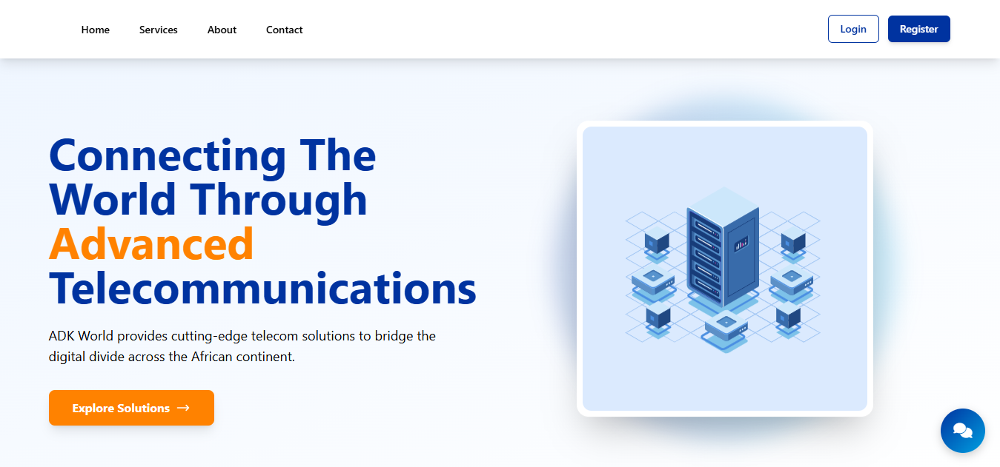
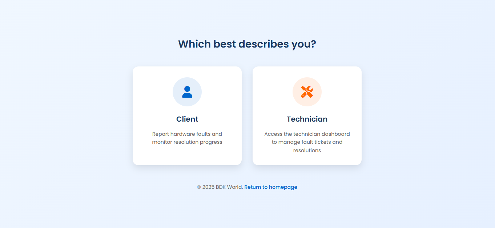
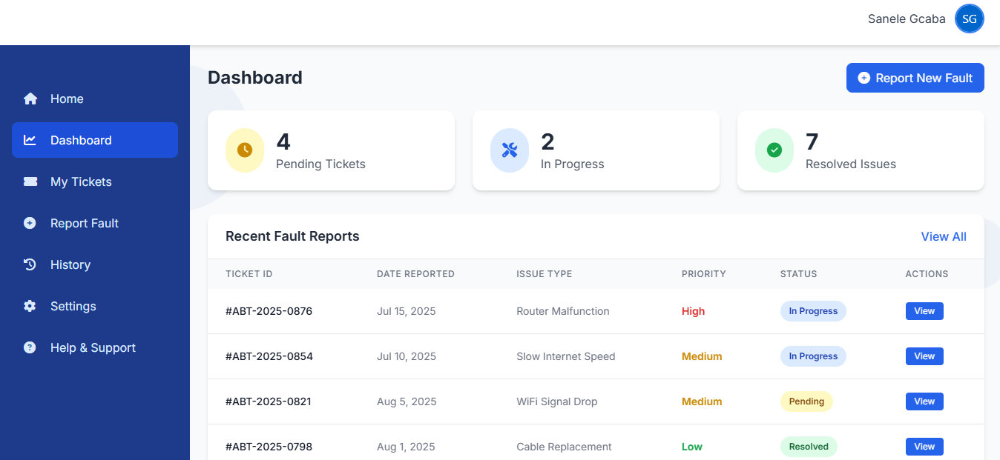
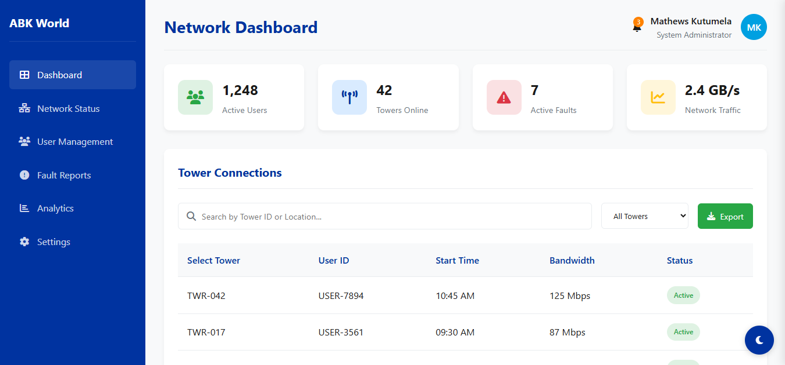
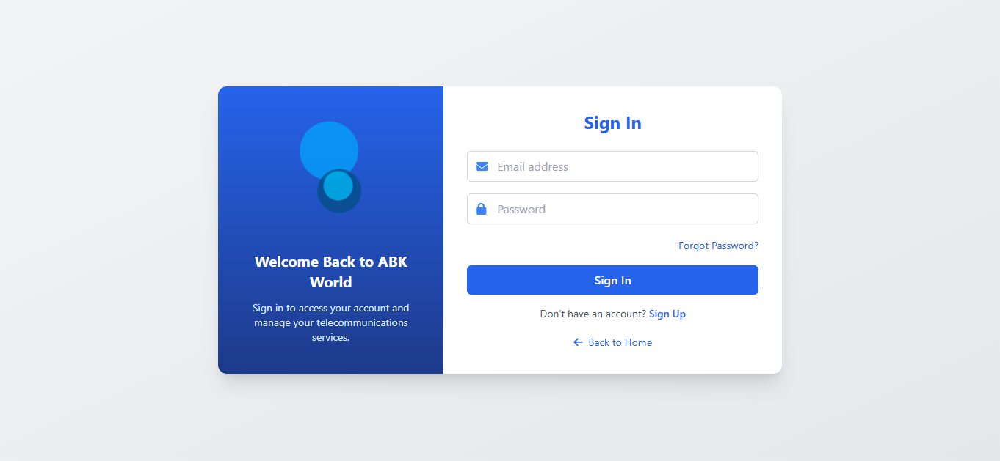
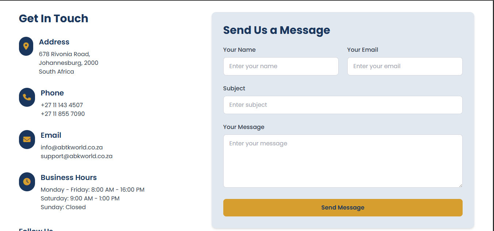
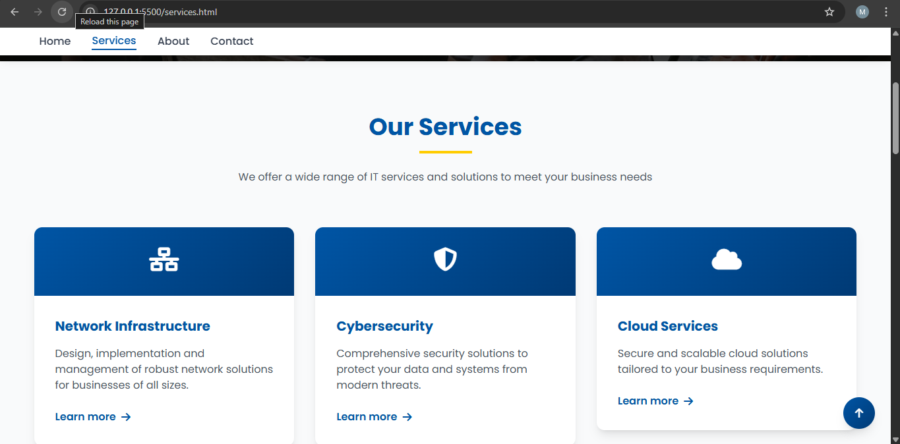
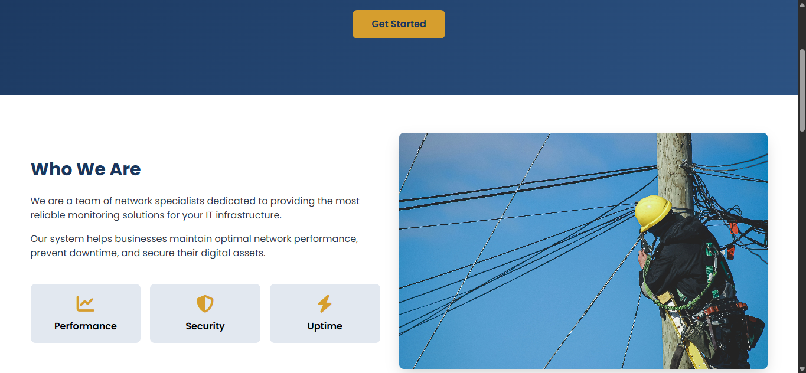

# 📡 ADK World Network Monitoring System

**ADK World Network Monitoring System** is a **web-based platform for telecom operations**. It provides a **role-based interface** for clients and technicians, allowing efficient interaction, monitoring, and support within telecom services.

---

## 🚀 Features

- 🌐 **Landing Page** – Introduces the system and highlights available services.  
- 📖 **About Page** – Displays company details and team profiles.  
- 👥 **Choose Role** – Allows users to select Client or Technician for personalized access.  
- 🖥 **Client Page** – Dedicated interface for client interactions.  
- 📊 **Dashboard** – Central hub for monitoring and updates.  
- 🔐 **Login & Register** – Secure authentication system.  
- 📞 **Contact Page** – Provides a communication form and social media links.  
- 🛠 **Services Page** – Lists all telecom services offered.

---

## 🛠 Technologies Used

- **HTML5** – Page structure  
- **CSS3** – Styling and layout  
- **JavaScript** – Interactivity  
- **Lottie Animations** – JSON-based graphics for smooth animations  

---

## 📷 Screenshots

### 🌐 Landing Page

### 👥 Role Selection

### 📊 Dashboard

### 🔐 Login Page

### 📞 Contact Page

### 🛠 Servives Page

###  📖 About Page

---

## 📌 Future Improvements

- 🔧 **Backend Integration** – ASP.NET Core API for dynamic data and user management.  
- 🗄 **Database Connectivity** – Store user and dashboard data for real-time access.  
- 🌐 **Real-Time Monitoring** – WebSocket updates for live network metrics.  
- 🔐 **Role-Based Access Control** – Secure permissions for clients and technicians.  
- 📊 **Enhanced Dashboards** – Data visualization for performance metrics.

---

## 📁 Project Structure
